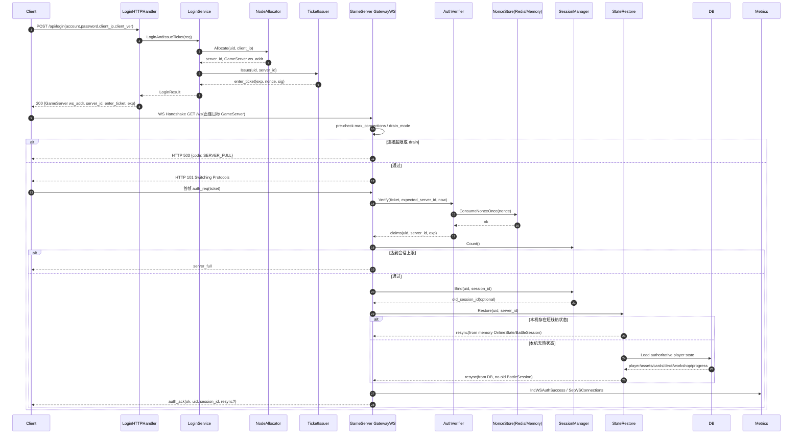
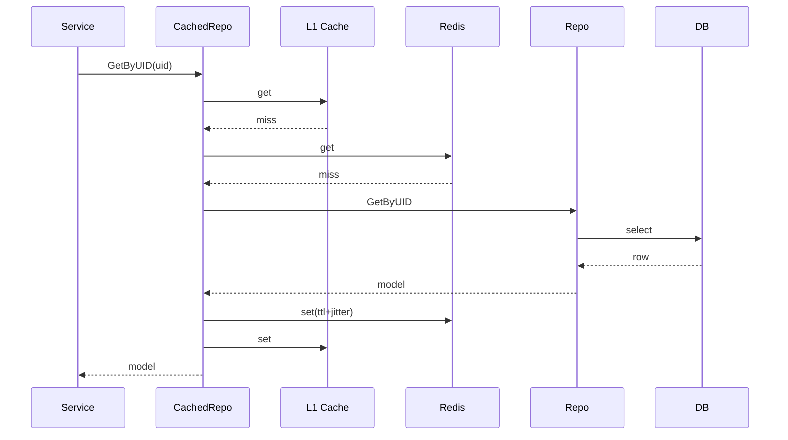
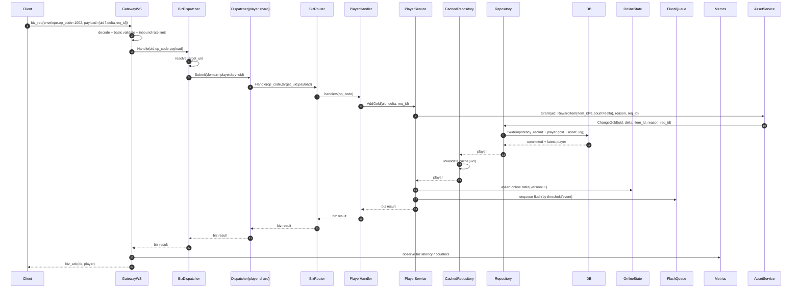
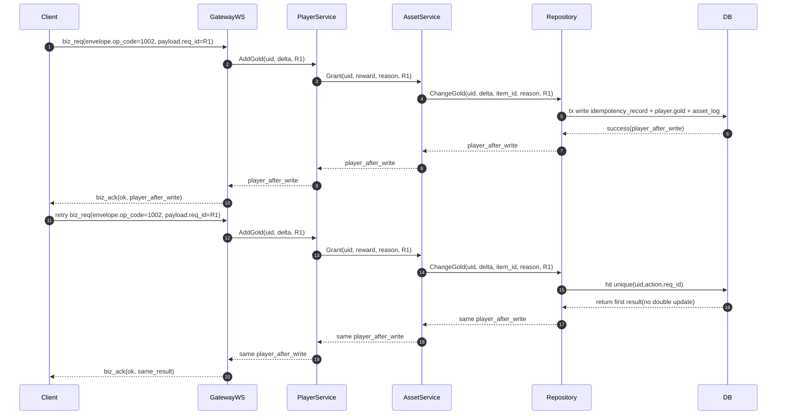
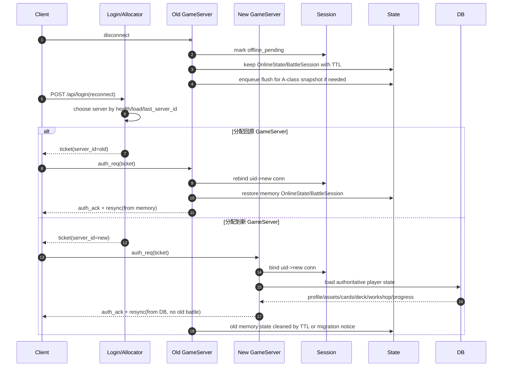
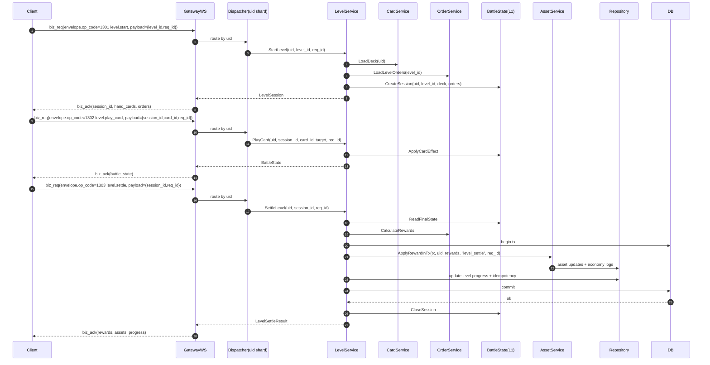
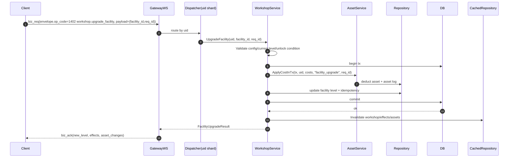

# 后端技术架构设计（卡牌休闲 MVP）

## -1. 文档定位

本文档是卡牌休闲游戏 MVP 的后端技术架构细节文档。

本文档负责说明：

- 网络层、协议层、会话层、鉴权与断线重连。
- dispatcher、goroutine 并发模型、背压、限流和慢客户端治理。
- 缓存、Redis、DB、Repository、CachedRepository 和一致性策略。
- A 类数据事务、幂等、资产流水和经济日志。
- MVP 业务服务接口、op_code、时序图和压测验收。

文档关系：

- [architecture_v2.md](/Users/bigfish/Project/go_orm_1/architecture_v2.md)：项目级后端架构总览。
- [backend_technical_architecture.md](/Users/bigfish/Project/go_orm_1/backend_technical_architecture.md)：后端技术架构细节，也就是本文档。
- [architecture_v2_task_breakdown.md](/Users/bigfish/Project/go_orm_1/architecture_v2_task_breakdown.md)：架构落地任务拆分。

## 0. 本期范围引用（MVP）
本文档不维护玩法数量、关卡数量、卡牌数量、设施数量等产品范围细节。

权威来源：

- Prototype/MVP 功能范围、数量和出口标准，见 [docs/design/mvp_scope.md](/Users/bigfish/Project/go_orm_1/docs/design/mvp_scope.md)。
- 各玩法细节，见 `docs/` 下对应系统设计文档。
- 后端模块、目录、协议、接口、数据表和压测细节，维护在本文档。

后端本期关注点：

1. 登录发票、WS 首帧验票、会话建立、单点踢线。
2. 玩家初始化、核心读写链路、A 类数据事务与幂等。
3. 资产、背包、卡牌、卡组、订单/关卡、局内逻辑、工坊等 MVP 主链路的后端承载。
4. `Service -> CachedRepository -> Repository -> Model -> DB` 数据访问链路。
5. 连接上限、限流、背压、慢客户端治理、监控与压测验收。
6. `globalcore/globalserver` 只建立代码边界，完整公共玩法业务以后续范围文档为准。

## 1. 文档目标
- 给出单节点（单进程）可落地的游戏服架构方案。
- 目标承载：单服稳定 `2000` 在线。
- 约束：当前登录能力先内置同进程模块（逻辑独立），后续可独立拆分。
- 方法：先模块化单体，后续按瓶颈平滑拆分。
- 实现策略：同进程部署、按多服务边界编码（接口先行），优先交付可用 Demo。
- 业务目标：支撑卡牌休闲游戏 MVP 主链路，即登录、建号、进入关卡、完成订单、结算奖励、卡牌成长、工坊成长。
- 执行拆分清单见：[architecture_v2_task_breakdown.md](/Users/bigfish/Project/go_orm_1/architecture_v2_task_breakdown.md)

## 2. 架构结论
1. 形态：模块化单体（非微服务），一个 `GameServer` 进程承载实时链路。
2. 职责划分：
- 登录模块（同进程）：认证、分配节点、发放 ticket。
- 游戏服：验票接入、会话管理、卡牌/订单/工坊等实时业务、状态持久化。
3. 设计边界：
- 逻辑按“多服务”划分（login/realtime/state/cache/repo），部署按“单进程”落地。
- 模块之间只走接口与 DTO，不直接引用内部实现，预留远程化替换点。
4. 数据访问链路：
- `Service -> CachedRepository -> Repository -> Model -> DB`
5. 状态分层：
- `L1` 内存热状态（进程内）
- `L2` Redis 临时共享状态
- `L3` MySQL/PostgreSQL 权威数据
6. 接入方案：
- MVP 采用“登录服短连接分配真实 GameServer 地址，客户端直连 GameServer”的方案。
- `AccessGateway` 不进入 MVP 主链路，只作为未来统一入口、隐藏源站或安全防护的演进方案。

## 3. 边界定义
1. 登录、账号、选服由 `login` 逻辑模块负责，当前与游戏服同进程部署。
2. `login` 与 `realtime` 通过接口边界交互，不直接共享内部实现细节。
3. GM 后台为独立系统，不进入实时主链路。
4. 当前阶段不引入策划分服逻辑；只保留性能扩容能力。
5. 好友/聊天/公会/邮件/排行完整业务后置，但 `globalcore/globalserver` 代码边界从 MVP 起建立。
6. Demo 阶段优先“可用闭环”，生产增强项（复杂风控、跨地域容灾）后置。
7. `globalcore` 以同进程本地公共领域模块存在；`globalserver` 在 MVP 就建立代码边界，但不独立启动、不做网络传输层。

## 4. 总体架构
```text
Client
  -> Login API(当前可与 GameServer 同进程部署)
      - login service
      - node allocator
      - ticket issuer
      - return server_id + GameServer ws_addr + enter_ticket

 Client
  -> GameServer gateway/ws(客户端直连)
      - auth
      - session
      - dispatcher
      - game services(player/asset/card/deck/order/battle/workshop)
      - globalcore(friend/chat/guild/mail/rank/notice local modules)
      - globalserver(same-process global jobs/service process boundary)
      - state manager
      - cached repository
      - repository
      - inproc event bus
  -> Redis
  -> MySQL/PostgreSQL
```

### 4.1 文字简图（分层）
```text
[Client]
   |
   +--> [Login API] --> [TicketIssuer] --> [ws_addr + server_id + ticket]
   |
   +--> [WebSocket Gateway] --> [Auth] --> [Session]
                                      |
                                      +--> [Redis: nonce/session_index]
                                      |
                                      +--> [Dispatcher(uid%N)]
                                                |
                                                +--> [Game Services]
                                                |        |
                                                |        +--> [Player/Asset]
                                                |        +--> [Card/Deck]
                                                |        +--> [Order/Battle]
                                                |        +--> [Workshop]
                                                |        +--> [Economy config helpers]
                                                |
                                                +--> [globalcore: Friend/Chat/Guild/Mail/Rank/Notice local modules]
                                                +--> [globalserver: same-process global jobs/service process boundary]
                                                |
                                                +--> [State: memory + flush_queue] --> [Redis]
                                                |
                                                +--> [CachedRepository] --> [Repository] --> [DB]
                                                                                      |
                                                                                      +--> [EventBus(in-proc)]
```

### 4.2 文字简图（主链路：登录 + 实时）
```text
登录发票:
[Client] -> [POST /api/login] -> [LoginService] -> [NodeAllocator] -> [TicketIssuer]
         <- [GameServer ws_addr, server_id, enter_ticket]

建连鉴权:
[Client] -> [GameServer WS /ws] -> [auth_req(ticket)] -> [Gateway] -> [AuthVerifier]
         -> [NonceStore(consume once)] -> [Session.Bind]
         <- [auth_ack(uid, session_id)]

业务写入:
[Client] -> [biz_req(op_code, req_id, payload)] -> [Gateway(limit/validate)]
         -> [Dispatcher(uid%N)] -> [GameService(player/card/order/workshop)]
         -> [CachedRepository] -> [Repository] -> [DB(tx,idempotent)]
         -> [invalidate cache] + [update online state] + [enqueue flush]
         <- [biz_ack(result)]
```

### 4.3 接入方案选择
MVP 明确采用方案 1。

```text
方案 1：登录服分配真实 GameServer 地址，客户端直连

Client -> LoginService/NodeAllocator
       <- server_id + GameServer ws_addr + enter_ticket
Client -> GameServer gateway/ws
```

选择原因：

- 单 GameServer 目标约 `2000` 在线，总在线 `2 万`、约 `15` 个 GameServer 的规模下，不需要额外引入长连接代理层。
- 登录服只处理登录和重连短请求，游戏消息不经过登录服。
- GameServer 内部 `gateway/ws` 直接负责 WS 接入、验票、心跳、限流、背压和协议编解码。
- 链路短、延迟低、排障简单，最适合 MVP 快速闭环。

未来可演进但不进入 MVP：

```text
方案 2：AccessGateway 连接透传/代理模型

Client -> AccessGateway -> GameServer gateway/ws
```

- `1` 个玩家通常对应 `1` 条 `Client -> AccessGateway` 连接和 `1` 条 `AccessGateway -> GameServer` 后端连接。
- GameServer 业务层基本不变，主要改登录返回地址、节点路由、真实 IP 传递、监控与运维。
- 适合需要统一入口、隐藏 GameServer 地址、入口安全防护或源站保护时引入。

```text
方案 3：AccessGateway 连接复用/多路复用模型

Client -> AccessGateway ==少量内网复用连接==> GameServer
```

- 性能上限更高，但复杂度最高。
- GameServer 需要处理虚拟连接、conn_id/uid 路由、断线通知、背压传播和消息顺序。
- 不适合 MVP，也不作为当前 `2 万` 在线目标的默认方案。

方案演进规则：

1. MVP 固定使用方案 1。
2. 方案 1 切换到方案 2 时，GameServer 业务模块原则上不改；只调整接入层、登录返回地址、节点路由和运维监控。
3. 方案 3 只有在总在线规模、统一入口复杂度或内网连接管理压力明显超过方案 2 能力后再评估。

说明：
1. 第一张图看层次与边界，第二张图看请求流向。
2. 单进程部署不改变模块边界，后续拆分时可按层/模块迁移。
3. 主读写链路保持 `Service -> CachedRepository -> Repository -> DB`。

## 5. 核心模块职责
### 5.1 login（同进程逻辑模块）
- 账号认证（当前阶段）
- 分配节点（当前单节点返回本节点；后续多节点按策略分配）
- 签发 `enter_ticket`
- 对外暴露登录 API（便于后续独立拆分）

### 5.1.1 HTTP 边界
- GameServer 不通过 HTTP 承载玩家玩法请求。
- HTTP 只用于登录发票、健康检查、指标、drain、管理开关和少量本地调试。
- 玩家玩法主链路统一走 `gateway/ws`，后续如切 TCP Socket，也应复用同一套业务分发入口。
- 禁止新增 `/api/player/*` 这类玩家直连 HTTP 玩法接口；需要调试时优先走 WS debug op_code 或受控 GM/管理接口。

### 5.2 gateway/ws
- WebSocket 连接管理
- 协议编解码
- 心跳保活
- 限流、背压、慢客户端治理
- 连接生命周期事件上报

### 5.3 auth
- 校验登录模块签发 `enter_ticket`
- 校验项：签名、过期时间、目标 server_id、nonce 一次性
- 验票通过后允许创建会话

### 5.4 session
- `uid -> conn/session` 绑定
- 单点登录踢旧连接
- 重连恢复会话上下文
- 断线回收

### 5.5 game（业务模块）
- 承载 MVP 主链路业务模块
- 子域：`player`、`asset`、`inventory`、`card`、`deck`、`order`、`battle`、`workshop`
- 只依赖服务接口与仓储接口
- 不直接触碰 Redis/SQL 细节
- 不承载好友、聊天、公会、邮件、排行榜等跨玩家公共域完整逻辑

### 5.5.1 globalcore 与 globalserver
- 目标：收敛跨玩家公共域逻辑，避免散落在各业务模块。
- 子域：`Friend`、`Chat`、`Guild`、`Mail`、`Rank`、`Notice`。

公共能力在代码目录上拆成两类：

| 类型 | 说明 | 当前是否做 |
|---|---|---|
| `globalcore` 本地公共领域模块 | 代码边界独立，但仍在 GameServer 进程内执行，请求期可直接调用 | MVP 使用 |
| `globalserver` 公共服逻辑模块 | 周期结算、批处理、跨服聚合、独立公共服进程入口逻辑 | MVP 写代码边界，同进程直调 |

`globalcore` 规则：

- 当前部署：同 GameServer 进程内执行。
- 当前边界：`interface + local adapter`。
- 适合：请求期公共数据读写，例如提交排行榜分数、查询公会信息、发送频道消息。
- 重要约束：`globalcore` 当前不是独立公共服务进程。
- 演进：后续可把本地实现替换为 remote client。

`globalserver` 规则：

- 当前部署：MVP 不独立启动，不提供 RPC/HTTP 等数据传输层。
- 当前用途：从 MVP 开始建立代码边界，承载未来独立公共服进程或全局 job 的逻辑。
- 适合：排行榜赛季结算、公会赛季结算、批量邮件、跨服聚合、全局定时任务。
- 调用方式：初版由 GameServer、管理入口或测试脚本同进程直接调用。
- 演进：后续可增加 `cmd/globalserver` 或独立 job 入口，并补数据传输层。

示例：

```text
game/battle
  -> rank.SubmitScore()

MVP:
  rank = globalcore/rank.LocalRankModule(redis/db)

未来:
  rank = globalcore/rank.RemoteRankClient(rpc/http)

排行榜赛季结算:
  globalserver/rank.SettleSeason()
```

判断规则：

1. 玩家请求链路内可完成的公共数据操作，放 `globalcore`。
2. 周期结算、批处理、跨服聚合、公共服进程入口逻辑，放 `globalserver`。
3. 需要跨多个 GameServer 实时统一状态时，`globalcore` 可替换为 remote client。
4. game 模块不直接操作 globalcore 的内部 DB 表、Redis key、ZSET 或内存结构。
5. GameServer 主链路不依赖独立 `globalserver` 进程启动；MVP 可同进程调用其代码。

### 5.5.2 可迁移代码边界与反过度拆分原则
不是所有业务都需要按远程服务形态设计。MVP 的目标是快速形成可运行 Demo，同时保留未来必要的拆分空间。

需要或未来可能迁移到 `globalserver` 的代码，应按接口化、DTO 化、无 GameServer 私有运行时依赖的方式实现。

明确只适合在 GameServer 本地运行的业务，不强行抽象成 remote client，不额外制造 handler、adapter、transport、DTO 套娃。

执行规则：

- 只有“可迁移模块列表”中的模块，才必须按可远程化边界实现。
- 不在列表中的模块，默认按 GameServer 本地模块简单实现。
- 后续如果某个模块确认要迁移，先更新本文档列表，再调整代码边界。
- 禁止为了统一风格，把所有业务都包装成 `interface + client + adapter + handler`。

可迁移模块列表：

| 模块 | 当前位置 | 未来可能位置 | 实现要求 | MVP 要求 |
|---|---|---|---|---|
| `login` | `internal/platform/login` | 独立 LoginServer | 接口化，ticket/allocator DTO 稳定 | 当前同进程 HTTP |
| `globalcore/rank` | GameServer 同进程 | `globalserver/rank` 或独立 RankService | `RankService` 接口，支持 `LocalRankService` 与 `RemoteRankClient` | 可先本地实现 |
| `globalcore/mail` | GameServer 同进程 | `globalserver/mail` 或独立 MailService | 接口化，发放/领取幂等，附件持久化 | 可先占位或简化 |
| `globalcore/chat` | GameServer 同进程 | `globalserver/chat` 或独立 ChatService | 接口化，不依赖本机连接对象，消息可持久化或短期缓存 | MVP 可只占位 |
| `globalcore/guild` | GameServer 同进程 | `globalserver/guild` 或独立 GuildService | 接口化，公会数据以 DB/Redis 为权威 | MVP 可只占位 |
| `globalcore/friend` | GameServer 同进程 | `globalserver/friend` 或独立 FriendService | 接口化，关系链持久化 | MVP 可只占位 |
| `globalcore/notice` | GameServer 同进程 | `globalserver/notice` 或独立 NoticeService | 接口化，公告配置/有效期持久化 | MVP 可只占位 |
| `globalserver/rank` | 同进程 job 代码 | 独立 GlobalServer job | 无 GameServer 私有状态依赖，结算幂等 | 写代码边界 |
| `globalserver/mail` | 同进程 job 代码 | 独立 GlobalServer job | 批量发放幂等，可失败重试 | 写代码边界 |
| `globalserver/activity` | 同进程 job 代码 | 独立 GlobalServer job | 活动结算输入显式化，输出持久化 | 按需骨架 |
| `event/outbox` | 同进程重试队列 | MQ/Outbox 消费服务 | 事件契约稳定，消费者幂等 | 可先本地队列 |
| `battle/worker` | GameServer 内函数调用 | 独立 BattleWorker | 仅纯计算可迁移，输入快照、输出结果 | 暂不强制拆 |

说明：

- `battle/worker` 只代表“无状态战斗计算”候选，不包含局内连接、回合状态、推送逻辑。
- `globalcore/*` 的本地实现必须按未来 remote implementation 的约束编写，不能拿 `session`、`conn`、`OnlineState`。
- `RemoteClient` 不需要在 MVP 立即实现，但接口、DTO、幂等规则要从一开始稳定。
- 列表外模块如果只有一个本地调用方、一个本地实现，先不抽远程接口。

所有模块列表：

| 模块 | 归属 | 迁移状态 |
|---|---|---|
| `cmd/gameserver` | 进程入口 | 本地 |
| `cmd/globalserver` | 未来进程入口 | 迁移白名单 |
| `app` | 启动编排 | 本地 |
| `login` | 登录/分配/发票 | 迁移白名单 |
| `gateway/ws` | WebSocket 接入 | 本地 |
| `auth` | 游戏服验票 | 本地 |
| `session` | 会话管理 | 本地 |
| `dispatcher` | 玩家分片执行 | 本地 |
| `state` | 在线热状态/刷盘 | 本地 |
| `game/player` | 玩家资料 | 本地 |
| `game/asset` | 资产与资源流水 | 本地 |
| `game/inventory` | 背包道具 | 本地 |
| `game/card` | 卡牌库存与升级 | 本地 |
| `game/deck` | 卡组编辑 | 本地 |
| `game/order` | 订单玩法 | 本地 |
| `game/battle` | 局内战斗运行时 | 本地 |
| `battle/worker` | 无状态战斗计算 | 迁移白名单 |
| `game/workshop` | 工坊系统 | 本地 |
| `game/economy` | 经济配置与公式 | 本地 |
| `globalcore/rank` | 排行榜请求期能力 | 迁移白名单 |
| `globalcore/mail` | 邮件请求期能力 | 迁移白名单 |
| `globalcore/chat` | 聊天请求期能力 | 迁移白名单 |
| `globalcore/guild` | 公会请求期能力 | 迁移白名单 |
| `globalcore/friend` | 好友请求期能力 | 迁移白名单 |
| `globalcore/notice` | 公告请求期能力 | 迁移白名单 |
| `globalserver/rank` | 排行榜结算/Job | 迁移白名单 |
| `globalserver/mail` | 批量邮件/补偿 | 迁移白名单 |
| `globalserver/activity` | 活动结算/Job | 迁移白名单 |
| `event/outbox` | 事件可靠性 | 迁移白名单 |
| `repo` | 数据访问 | 本地复用基础代码 |
| `cache` | 缓存策略 | 本地复用基础代码 |
| `gamedata` | 静态配置 | 本地复用基础代码 |
| `infra` | DB/Redis/日志/配置 | 本地复用基础代码 |

迁移判断维度：

| 类型 | 示例 | 实现要求 |
|---|---|---|
| 跨玩家公共数据 | 排行榜、邮件、公会、好友、聊天、公告 | 通过 `globalcore` 接口访问，内部可先本地实现 |
| 周期结算/批处理 | 排行榜赛季结算、批量邮件、活动结算 | 放 `globalserver` 代码边界，MVP 同进程调用 |
| 需要独立扩容 | 高频聊天、热点排行榜、大规模公会活动 | 预留 remote client 替换点 |
| 需要独立 SLA | 邮件补偿、排行榜发奖、全局活动结算 | 必须有幂等键、任务状态、失败重试 |
| 多 GameServer 共享状态 | 跨服榜、世界频道、全局公告 | 不能依赖本机内存，必须以 DB/Redis 为权威或共享介质 |

不建议迁移：

| 类型 | 示例 | 原因 |
|---|---|---|
| 强依赖连接 | WS 收发、心跳、踢线、慢客户端处理 | 只能在持有连接的 GameServer 内执行 |
| 强依赖在线热状态 | 当前手牌、当前回合、局内订单进度 | 跨进程远程化会增加延迟与一致性成本 |
| 单玩家高频轻逻辑 | 普通背包查询、卡组编辑、本地配置校验 | 远程化收益低，反而增加代码和调用成本 |
| 纯工具/配置逻辑 | 奖励解析、消耗校验、数值公式 | 保持普通包或函数即可，不必服务化 |
| MVP 临时调试能力 | add_gold、consume_gold debug 接口 | 只在测试入口保留，不进入正式拆分边界 |

说明：

- “本地”不代表永远不能调整，而是当前实现不要预先做远程化结构。
- `game/asset` 可暴露接口给 `globalserver` 发奖使用，但它本身仍是 GameServer 主业务模块。
- `repo/cache/infra/gamedata` 属于可复用基础代码，不归类为可迁移业务模块。

实现原则：

- 对迁移候选模块，业务方只依赖接口，不直接创建具体实现。
- 对非迁移模块，允许同模块内直接调用清晰的 service/repo，不强制套 remote client 结构。
- 接口边界服务于未来拆分和测试，不作为所有业务代码的默认模板。
- 先用简单结构实现 MVP，只有出现明确边界、共享状态、扩容或 SLA 诉求时再升级抽象。
- 如果一个抽象目前只有一个调用方、一个实现、没有迁移计划，可以先不抽。

示例：

```text
推荐抽接口:
  game/battle -> globalcore/rank.RankService
  原因: 排行榜未来可能迁移到 globalserver。

不强制抽远程接口:
  game/card -> card.ConfigValidator
  原因: 纯本地配置校验，不需要独立服务。

保持本地内聚:
  game/battle -> battle.Session
  原因: 局内状态依赖本机内存和连接时序。
```

### 5.5.3 globalserver 独立部署约束
`globalserver` 从 MVP 起就按“未来可独立部署”的代码边界设计，但 MVP 阶段不要求真的启动独立进程。

当前阶段：

- `globalserver` 是同仓库、同进程、同部署包内的公共服逻辑模块。
- GameServer、GM/Admin 入口、测试脚本可以通过 Go 接口同进程调用它。
- 不引入 RPC、HTTP、MQ 等传输层，避免 Demo 阶段复杂度过高。
- 不要求 `globalserver` 独立保活、独立扩容、独立告警，但代码要保留这些演进空间。

未来独立部署时：

- 增加 `cmd/globalserver` 启动入口。
- 增加独立配置、日志、监控、健康检查。
- 增加 transport adapter，例如 HTTP/gRPC/MQ/Scheduler。
- GameServer 侧把本地调用替换为 remote client。
- 原有领域接口、请求 DTO、幂等规则保持不变。

允许依赖：

| 依赖 | 说明 |
|---|---|
| `gamedata` | 静态配置、奖励配置、排行榜配置、活动配置 |
| `repo` | 公共域数据库访问，例如 mail、rank、guild、job record |
| `infra/db` | 事务与连接管理 |
| `infra/redis` | 排行榜 ZSET、分布式锁、短期 job 状态 |
| `infra/log` / `infra/metrics` | 日志、指标、告警 |
| `globalcore` 接口 | 可复用公共领域接口与 DTO |
| `game/asset` 接口 | 仅允许通过接口发奖或生成奖励记录，不能直接改玩家内存态 |

禁止依赖：

| 禁止依赖 | 原因 |
|---|---|
| `gateway/ws` | 独立公共服不应该持有客户端连接 |
| `session.Manager` | 公共服不能依赖玩家当前是否在线 |
| `dispatcher` | 公共服 job 不走玩家分片执行器 |
| `state.OnlineState` | 在线热状态属于 GameServer 本机内存 |
| `game/battle` 局内内存态 | 战斗临时态不能成为公共服结算前置条件 |
| `BizRouter` / `BizHandler` | 协议分发层不能反向进入公共服逻辑 |
| 具体 `conn` / `client` 对象 | 公共服只产出结果，不直接推送连接 |

设计原则：

- `globalserver` 的输入必须是显式参数或 DB/Redis 中可查询的数据，不能读取 GameServer 私有内存。
- `globalserver` 的输出必须是可持久化结果，例如奖励记录、邮件、排行榜快照、结算状态。
- 需要通知在线玩家时，先写持久化结果，再由 GameServer 通过 `globalcore/mail`、push 或登录拉取完成通知。
- 所有可重复触发的结算、批处理、补偿任务必须具备幂等键。
- 任何 globalserver 任务都应支持失败重试，不依赖“只执行一次”的进程假设。

典型例子：

```text
玩家完成活动战斗:
  game/battle.Settle()
    -> globalcore/rank.UpdateScore(board_id, uid, score, req_id)

排行榜赛季结束:
  globalserver/rank.SettleSeason(board_id, season_id, settlement_id)
    -> 读取 Redis ZSET / rank_snapshot
    -> 生成 rank_reward
    -> 写 mail 或 reward record
    -> 标记 rank_settlement done

未来拆分后:
  GameServer
    -> RankClient.UpdateScore()
  GlobalServer
    -> RankService.UpdateScore()
    -> RankSettlementJob.SettleSeason()
```

### 5.5.4 MVP 业务子模块
| 模块 | 职责 | 数据写入要求 |
|---|---|---|
| `player` | 建号、基础资料、等级、章节进度 | A 类数据，事务写 |
| `asset` | 金币、钻石、体力、声望、材料、碎片、发奖扣费、流水 | A 类数据，事务 + 幂等 |
| `inventory` | 普通道具、材料、宝箱、消耗券 | A 类数据，事务 + 幂等 |
| `card` | 卡牌库存、卡牌升级、碎片消耗 | A 类数据，事务 + 幂等 |
| `deck` | 卡组编辑、卡组保存、卡组校验 | A 类数据，事务写 |
| `order` | 订单配置、订单生成、订单完成判定 | 结算时事务写 |
| `battle` | 单局状态、出牌、回合推进、局内订单进度 | B 类在线状态，结算转 A 类 |
| `workshop` | 工坊设施、升级、离线收益、装饰槽位 | A 类数据，事务 + 幂等 |
| `economy` | 奖励、消耗、资源价值换算配置辅助 | 默认无独立玩家表 |

说明：

- `battle` 的局内状态优先放内存，局结束后只写结算结果。
- `asset` 是所有资源变化的唯一入口，其他模块不直接改金币、材料、碎片。
- `order` 与 `battle` 可以同进程内直接调用，但接口上保持独立，便于后续把战斗计算拆成 Worker。
- `economy` MVP 可先作为配置解析与工具函数，不一定单独成为复杂服务。

### 5.6 state
- 在线热状态托管（内存优先）
- 定时或事件驱动刷盘
- 断线标记与恢复策略

### 5.7 repository
- 纯数据库 CRUD、事务、批量写
- 不包含缓存逻辑

### 5.8 cached repository
- Cache-Aside
- singleflight 防击穿
- 空值缓存、防穿透、TTL 抖动
- 缓存失效策略

### 5.9 infra
- 配置、日志、监控、告警
- 健康检查、优雅关服、运行开关

### 5.10 service ports（拆分预留）
- `LoginPort`：登录请求入口（当前为进程内 HTTP handler）
- `RealtimePort`：WS 接入入口
- `StatePort`：状态刷盘与恢复入口
- `RepoPort`：数据访问入口
- 要求：只有明确可能外部化的边界才强制 `interface + local adapter`
- 说明：普通本地业务模块不为了形式统一而强制增加 adapter
- 演进：未来拆分时在边界外增加 `rpc/http/mq adapter`，不改变业务接口语义

## 6. 关键协议
### 6.0 账号登录态与 GameServer 入场票
正式架构分两层凭证：

```text
account_token / refresh_token
  - 证明“玩家是谁”
  - 由 LoginService/账号系统签发和校验
  - 有效期较长，支持 App 重启、杀端恢复、断线后免密

enter_ticket
  - 证明“玩家本次被允许进入哪台 GameServer”
  - 由 LoginService 在选服后签发
  - TTL 很短，一次性消费，包含 uid/server_id/exp/nonce
```

职责边界：

1. `account_token` 不直接交给 GameServer 做完整账号鉴权。
2. GameServer 只校验 `enter_ticket`，不关心账号密码、平台 SDK、refresh token。
3. 断线重连不是重新输入密码，而是客户端用已有账号登录态向 LoginService 换取新的 `enter_ticket`。
4. 玩家显式退出登录时，客户端删除账号登录态，服务端可使 refresh token 失效；下次才需要重新账号登录。
5. MVP 阶段可以用 `/api/login` 同时完成账号简化校验、选服和发 `enter_ticket`；正式版本建议拆成 `/api/login`、`/api/enter`、`/api/reconnect`。

推荐正式流程：

```text
首次账号登录:
Client -> LoginService: account/password 或 platform_token
Client <- LoginService: account_token + refresh_token

进入游戏服:
Client -> LoginService: account_token
LoginService -> NodeAllocator: choose GameServer
Client <- LoginService: server_id + ws_addr + enter_ticket
Client -> GameServer gateway/ws: auth_req(enter_ticket)

断线重连/杀端恢复:
Client -> LoginService: account_token 或 refresh_token
LoginService -> NodeAllocator: choose GameServer
Client <- LoginService: server_id + ws_addr + new enter_ticket
Client -> GameServer gateway/ws: auth_req(new enter_ticket)
```

### 6.1 登录接入协议
1. 客户端先调用登录 API，登录模块内部调用 `NodeAllocator` 分配目标 GameServer。
2. 登录 API 返回：`GameServer ws_addr + server_id + enter_ticket`。
3. 客户端使用返回的 `ws_addr` 直连目标 GameServer 的 `gateway/ws`。
4. 客户端连接游戏服后首帧必须 `auth(ticket)`。
5. GameServer 校验 `ticket.server_id` 必须等于自身 `server_id`。
6. GameServer 验票成功后创建会话并返回 `auth_ok`。
7. 达到上限返回 `SERVER_FULL`（单节点 Demo 默认 `candidates=[]`）。

当前 MVP 不存在：

- 登录服转发游戏消息。
- AccessGateway 代理游戏长连接。
- GameServer 自己决定玩家应该连接哪个节点。

未来如果引入 AccessGateway，协议语义不变，但登录 API 返回的 `ws_addr` 会从 `GameServer ws_addr` 变成 `AccessGateway ws_addr`，AccessGateway 再根据 `ticket.server_id` 路由到目标 GameServer。

### 6.2 enter_ticket 字段建议
- `uid`
- `server_id`
- `exp`
- `nonce`
- `sig`（JWT 或 HMAC）

### 6.3 错误码建议
- `AUTH_INVALID`
- `AUTH_EXPIRED`
- `AUTH_REPLAY`
- `SERVER_FULL`
- `RATE_LIMITED`
- `INTERNAL_ERROR`

## 7. 核心流程
### 7.1 登录接入流程
1. 客户端调用登录模块 API
2. 登录模块分配节点并签发 ticket
3. 登录模块返回目标 GameServer 的 `server_id`、`ws_addr` 和 `enter_ticket`
4. 客户端直连目标 GameServer 的 `gateway/ws` 并发送 auth
5. 游戏服验票通过后建立 session

说明：

- `NodeAllocator` 是登录服内部的节点分配模块，不是独立进程。
- 登录服只参与登录和重连分配，不转发后续游戏消息。
- GameServer 不参与选服，只验证 ticket 中的 `server_id` 是否等于自己。

### 7.2 读流程
1. `Service -> CachedRepository.GetX`
2. 命中缓存直接返回
3. 未命中回源 DB
4. 回填缓存并返回

### 7.3 写流程
1. `Service` 完成业务判断，决定本次消耗、奖励和玩法状态变更。
2. 涉及资产、领奖状态、购买次数、成长结果的 A 类写入，必须进入同一事务。
3. 事务内由 `Service` 编排 `Cost/Reward` 写入器与领域 `Repository`；`Repository` 只负责表读写，不反向编排发奖或跨玩法业务。
4. 事务提交成功后，删除 L1 读缓存或 Redis 共享缓存中的旧副本，并同步在线热状态。
5. 返回客户端。

### 7.4 断线流程
1. 连接断开
2. Session 标记离线
3. 原 GameServer 保留在线热状态一段 TTL（建议 `5~10` 分钟）
4. 关键 A 类数据仍以 DB 为准，断线时可触发 flush 或入队异步刷盘
5. 玩家重连时由 `Login/NodeAllocator` 决定分配到哪个 GameServer
6. 如果分配回原 GameServer，优先恢复本机内存热状态
7. 如果分配到新 GameServer，不恢复旧服内存态，直接从 DB 重建长期状态
8. 原 GameServer 的内存态 MVP 使用 TTL 超时清理，后续可通过迁移通知立即清理

### 7.4.1 重连分配规则
分配规则属于 `Login/NodeAllocator`，不写死在 GameServer。

推荐规则：

1. 查询 `uid -> last_server_id` 或 `session_index.server_id`。
2. 如果原 server 健康、未满载、非 drain，优先分配回原 server。
3. 如果原 server 不健康、满载、drain 或策略要求迁移，则分配到新 server。
4. ticket 中写入最终 `server_id`。
5. GameServer 只验证 ticket 是否属于自己，不决定玩家该去哪个服。

MVP 实现说明：

1. 当前可在 `LoginService` 发票成功后记录 `uid -> server_id`，表示“最近分配节点”。
2. 这个记录用于下一次登录/重连时优先尝试原 GameServer。
3. 记录失败不阻断登录主链路，避免会话索引短暂异常影响玩家进入。
4. 更严格的生产增强方案是在 GameServer 首帧鉴权成功后记录 `uid -> server_id`，表示“最近成功进入节点”。
5. MVP 暂不强制引入 GameServer 鉴权成功回调，避免接入层复杂化；未来多节点部署前再替换为 Redis/DB 存储和鉴权成功写入。

跨服重连规则：

1. 新 GameServer 从 DB 读取玩家资料、资产、卡牌、卡组、工坊、关卡进度。
2. 不读取旧 GameServer 内存中的 `BattleSession`。
3. 未结算局内状态视为中断，MVP 可按放弃或失败补偿处理。
4. 原 GameServer 通过 TTL 清理旧 `OnlineState/BattleSession`。

### 7.4.2 session_id 与 conn_id 口径
MVP 阶段不强制拆分 `session_id` 和 `conn_id`。

当前定义：

```text
session_id = 本次成功鉴权后创建的连接会话 ID
```

含义：

1. 每次客户端连接 GameServer 并通过 `auth_req(enter_ticket)` 后，GameServer 生成一个新的 UUID。
2. 这个 UUID 对外返回为 `auth_ack.payload.session_id`。
3. 这个 UUID 在 GameServer 内部也可作为当前连接 ID 使用，用于踢旧连接、断线清理和日志追踪。
4. 断线后重新走 LoginService 拿新的 `enter_ticket`，再连接 GameServer，会产生新的 `session_id`。
5. 因此 MVP 中“重连”可以视为“重新创建连接会话”，不是恢复同一个长期 session。

未来如果要支持“短线恢复仍算同一次连续会话”，再拆成：

```text
session_id = 连续游戏会话 ID，短线重连可保持不变
conn_id    = 单条网络连接 ID，每次 WS 连接都会变化
```

在当前阶段，文档和代码都按简化口径处理：

```text
MVP: session_id == 当前连接 ID
```

### 7.5 异步刷盘策略（Demo 必做）
1. 触发条件：定时（默认 `5s`）+ 关键事件（下线、资产变更阈值触发）
2. 批量参数：单批 `100~500` 条，单批超时 `200ms`
3. 重试策略：指数退避（`100ms -> 200ms -> 400ms`，最多 3 次）
4. 失败处理：超过重试进入失败队列并告警，不阻塞实时主线程
5. 关服保障：进入 `drain` 后执行一次全量 flush，再退出进程

## 8. 并发与执行模型
1. 网络层：每连接独立读写协程
2. 逻辑层：按路由键分片串行（建议 `N=64`）
- 玩家域：`player_id % N`
- 公会域：`guild_id % N`
- 聊天房间域：`channel_id % N`
3. 跨域操作（如公会审批后发系统邮件）必须走事件编排，避免直接跨分片锁。
4. 持久化：异步刷盘队列，批量写入 DB
5. 广播：按房间/频道，避免高频全服广播
6. 队列策略：消息按优先级处理，低优先级可降级或丢弃
7. 资源隔离：`login` 与 `realtime` 使用独立 worker 池与限流器，避免互相挤压。

### 8.1 事件可靠性机制（同进程先行，后续可迁移 MQ）
1. 事件字段统一：`event_id`、`event_type`、`occur_at`、`trace_id`、`version`
2. 发布顺序：业务事务提交成功后再发布事件，避免事务回滚后脏事件
3. 消费幂等：按 `event_id` 去重，重复投递必须可重放
4. 失败处理：失败进入重试队列；超过阈值进入死信队列（DLQ）并告警
5. 迁移策略：后续拆分服务时切换为 `Outbox + MQ`，不改事件契约

## 9. 缓存与数据分层
### 9.1 在线热状态（GameServer 内存态）
- 在线热状态不是读缓存，而是当前 GameServer 中正在运行的玩家/战斗/房间状态。
- 生命周期通常覆盖玩家在线期间或战斗/房间生命周期，不是单次请求局部变量。
- 适合：当前连接玩家快照、战斗临时态、关卡局内状态、短期上下文。
- 规则：业务成功后直接更新；关键节点写 DB；不能把它当作可随意删除的缓存。

### 9.2 L1 进程内读缓存
- L1 读缓存是 DB 查询结果副本，用于减少重复读库。
- 适合：昵称、头像、等级展示、战力摘要、好友/排行/公会成员名片等展示或低实时性数据。
- 不适合：金币是否足够、道具是否足够、是否已领奖、是否可升级等业务判定。
- 写入 A 类数据成功后，删除对应 L1 读缓存；下次读取再从 DB 回源。

### 9.3 L2（Redis）
- ticket nonce
- 会话索引
- 热点对象快照

### 9.4 L3（DB）
- 玩家资产
- 背包
- 成长数据
- 操作日志

### 9.5 缓存策略
- 展示资料：可放 L1 读缓存，TTL 可相对较长。
- 高频强一致资产：不依赖 L1 做业务判定，必要时只作为展示快照。
- 在线运行态：放在线热状态，不归入 L1 读缓存。
- 防护：空值缓存、singleflight、TTL 抖动、防穿透

### 9.6 数据一致性分级（必须执行）
- A类（强一致）：玩家资料、资产、背包核心道具、卡牌库存、卡组、工坊设施、关卡结算
- B类（最终一致）：在线状态、离线快照、排行榜快照、统计计数
- C类（临时态）：心跳、局内战斗上下文、推送游标、临时手牌状态

规则：
1. A类只能走 DB 事务权威写，写后失效 L1/Redis 读缓存，不允许“仅内存后刷盘”。
2. B类允许内存先行 + 异步刷盘，但必须带版本号或时间戳做覆盖保护。
3. C类仅保留在内存或 Redis，进程重启可丢弃。

### 9.7 幂等要求（资金/道具必需）
- 所有会修改 A类数据的接口必须携带 `req_id`。
- DB 侧建立幂等记录（唯一键：`uid + req_id + action`）。
- 重试命中幂等时返回首次结果，不重复执行副作用。


### 9.8 资源与道具存储路由规则
资源和道具的“业务入口”与“存储位置”分开设计。

核心规则：

1. 玩法 `Service` 决定“能不能执行、扣什么、发什么、更新什么玩法状态”。
2. `CostService/RewardService` 只负责按 `cost_list/reward_list` 扣除或发放资产、写流水和保证幂等。
3. `CostService/RewardService` 负责对同一批 `cost_list/reward_list` 做通用标准化，例如合并相同 `item_id`；这不属于玩法规则，不应散落在各玩法 `Service` 中。
4. 事务边界由玩法 `Service` 或事务管理器建立；`Repository` 不调用发奖逻辑，不编排跨领域业务。
5. `CostService/RewardService` 必须提供事务内入口，例如 `ApplyCostInTx`、`ApplyRewardInTx`，用于和玩法状态更新放进同一事务。
6. 独立补偿、GM 补发、邮件附件等不需要绑定玩法状态的场景，可以使用自带事务的 `Grant/Consume` 便捷入口。
7. `RewardItem` / `CostItem` 统一使用 `item_id + count`，不让业务方直接关心落库位置。
8. `ItemConfig` 是策划静态配置，策划源使用 Excel，程序运行配置使用导出的 JSON，服务端启动时加载到内存。
9. `ItemConfig.storage_type` 决定资源或道具实际写入哪个表。
10. 无论最终写入哪个表，都必须有统一流水，方便按 `item_id` 查询来源和消耗。

存储分类：

| 类型 | 存储位置 | 示例 | 说明 |
|---|---|---|---|
| 高频基础货币 | `player_profile` 或同类玩家基础表字段 | 金币、钻石、体力、声望 | 读取频繁，首页常展示，可以直接放玩家表 |
| 跨系统可堆叠道具 | `player_item(uid, item_id, count)` | 材料、碎片、消耗券、宝箱钥匙 | 通用背包表只存可堆叠道具 |
| 系统专属资源 | 所属系统表字段 | 竞技币、公会贡献、活动币 | 如果只在单一系统内产消，放该系统表 |
| 不可堆叠实例 | 所属系统实例表 | 卡牌、装饰、宠物、装备 | 不进入通用背包表，按系统单独建表 |

`ItemConfig` 示例：

```json
[
  {
    "item_id": 1,
    "key": "gold",
    "name": "金币",
    "item_type": "currency",
    "storage_type": "player_field",
    "storage_key": "gold",
    "system": "base",
    "stackable": true,
    "visible_in_bag": false
  },
  {
    "item_id": 10001,
    "key": "basic_material",
    "name": "基础材料",
    "item_type": "material",
    "storage_type": "inventory_stack",
    "storage_key": "",
    "system": "common",
    "stackable": true,
    "visible_in_bag": true
  },
  {
    "item_id": 20001,
    "key": "bread_maker_card",
    "name": "面包师卡",
    "item_type": "card",
    "storage_type": "card_instance",
    "storage_key": "",
    "system": "card",
    "stackable": false,
    "visible_in_bag": false
  },
  {
    "item_id": 30001,
    "key": "arena_coin",
    "name": "竞技币",
    "item_type": "currency",
    "storage_type": "arena_field",
    "storage_key": "arena_coin",
    "system": "arena",
    "stackable": true,
    "visible_in_bag": false
  }
]
```

路由规则：

```text
RewardItem(item_id=1, count=100)
  -> ItemConfig.storage_type = player_field
  -> 更新 player_profile.gold

RewardItem(item_id=10001, count=5)
  -> ItemConfig.storage_type = inventory_stack
  -> 更新 player_item.count

RewardItem(item_id=20001, count=1)
  -> ItemConfig.storage_type = card_instance
  -> 创建 player_card 实例或增加卡牌系统拥有记录

RewardItem(item_id=30001, count=20)
  -> ItemConfig.storage_type = arena_field
  -> 更新 player_arena.arena_coin
```

不可堆叠道具规则：

- 通用 `player_item` 不存不可堆叠道具。
- 不可堆叠道具由所属系统单独建表，表内 `id` 为玩家拥有的实例流水号。
- 表内配置 ID 使用 `card_id`、`decoration_id`、`pet_id` 等系统语义字段，对应策划 `item_id`。
- 实例表按实际玩法保存 `level`、`exp`、`star`、`status`、`extra_json` 等字段。
- 统一日志中同时记录 `item_id`，必要时记录 `instance_id`，方便追踪来源。

示例：

```text
player_card
- id              # 玩家拥有的卡牌实例或拥有记录 ID
- uid
- card_id         # 策划配置 ID，可与 item_id 建映射
- level
- exp
- star
- created_at
- updated_at

player_decoration
- id
- uid
- decoration_id   # 策划配置 ID，可与 item_id 建映射
- level
- status
- slot_type
- created_at
- updated_at
```

MVP 执行建议：

- 高频基础货币可以继续存玩家表，MVP 不新增独立资产表。
- 通用背包表只实现可堆叠道具。
- 卡牌和工坊装饰由各自系统表管理。
- B1 阶段 `AssetService` 先支持 `player_field`（金币等玩家基础表字段）。
- B2 阶段接入 `inventory_stack`（通用可堆叠背包表）。
- 其他 `storage_type` 可先保留配置和接口边界。

### 9.7 Demo 最小关键表结构（建议）
```sql
-- 幂等记录：保障资产/道具写入不重复执行
CREATE TABLE IF NOT EXISTS idempotency_record (
  id BIGINT PRIMARY KEY AUTO_INCREMENT,
  uid VARCHAR(64) NOT NULL,
  action VARCHAR(64) NOT NULL,
  req_id VARCHAR(128) NOT NULL,
  result_json JSON NULL,
  created_at TIMESTAMP NOT NULL DEFAULT CURRENT_TIMESTAMP,
  UNIQUE KEY uk_uid_action_reqid (uid, action, req_id)
);

-- nonce 一次性消费记录：防重放
CREATE TABLE IF NOT EXISTS auth_nonce (
  nonce VARCHAR(128) PRIMARY KEY,
  expire_at TIMESTAMP NOT NULL,
  created_at TIMESTAMP NOT NULL DEFAULT CURRENT_TIMESTAMP
);

-- 会话索引：支持 uid -> session 快速查找
-- MVP 阶段 session_id 可直接作为当前连接 ID 使用；conn_id 字段预留给未来拆分连续会话与单条连接。
CREATE TABLE IF NOT EXISTS session_index (
  uid VARCHAR(64) PRIMARY KEY,
  server_id VARCHAR(64) NOT NULL,
  session_id VARCHAR(128) NOT NULL,
  conn_id VARCHAR(128),
  status TINYINT NOT NULL,
  last_seen_at TIMESTAMP NOT NULL,
  updated_at TIMESTAMP NOT NULL DEFAULT CURRENT_TIMESTAMP ON UPDATE CURRENT_TIMESTAMP
);

-- 事件外发表：后续拆分 MQ 时可直接启用
CREATE TABLE IF NOT EXISTS event_outbox (
  id BIGINT PRIMARY KEY AUTO_INCREMENT,
  event_id VARCHAR(128) NOT NULL,
  event_type VARCHAR(64) NOT NULL,
  payload_json JSON NOT NULL,
  status TINYINT NOT NULL DEFAULT 0,
  retry_count INT NOT NULL DEFAULT 0,
  created_at TIMESTAMP NOT NULL DEFAULT CURRENT_TIMESTAMP,
  UNIQUE KEY uk_event_id (event_id),
  KEY idx_status_created (status, created_at)
);
```

### 9.8 MVP 玩家数据表清单
MVP 至少需要以下业务表：

| 表 | 模块 | 说明 | 一致性 |
|---|---|---|---|
| `player_profile` | player/asset | uid、昵称、等级、章节进度；MVP 可包含金币、钻石、体力、声望等高频基础货币 | A |
| `player_item` | inventory | 可堆叠通用道具：材料、碎片、消耗券、宝箱钥匙等 | A |
| `player_card` | card | 卡牌拥有记录或实例：等级、经验、星级、数量等由卡牌系统定义 | A |
| `player_deck` | deck | 卡组方案、卡牌列表 | A |
| `player_level_progress` | order/level | 主线关卡进度、首通状态 | A |
| `player_workshop` | workshop | 工坊基础数据、离线收益结算时间 | A |
| `player_facility` | workshop | 设施等级、解锁状态 | A |
| `player_decoration` | workshop | 装饰拥有记录或实例，不进入通用背包 | A |
| `asset_log` | asset | 资源变动流水 | A |
| `economy_log` | economy | 经济场景流水，可与 asset_log 合并起步 | A |
| `idempotency_record` | infra | 写请求幂等记录 | A |

后续占位表：

| 表 | 模块 | MVP 状态 |
|---|---|---|
| `player_friend` | globalcore/friend | 只预留设计，不进入主链路 |
| `guild` / `guild_member` | globalcore/guild | 只预留设计 |
| `mail` / `mail_attachment` | globalcore/mail | 奖励补发后续实现 |
| `rank_snapshot` | globalcore/rank | 无尽订单排行后续实现 |
| `global_job_record` | globalserver | 全局 job 幂等、状态、重试记录 |
| `rank_settlement` | globalserver/rank | 排行榜赛季结算状态 |
| `rank_reward` | globalserver/rank | 排行榜奖励生成与领取状态 |

### 9.9 globalserver 任务数据表约束
`globalserver` 的任务可能被手动触发、定时触发、失败重试或未来多实例抢占执行，因此必须从 MVP 起就设计幂等表。

建议表：

| 表 | 唯一键 | 说明 |
|---|---|---|
| `global_job_record` | `job_id` | 全局任务执行记录，例如排行榜结算、批量邮件、补偿脚本 |
| `rank_settlement` | `board_id + season_id` | 某排行榜某赛季只能完成一次结算 |
| `rank_reward` | `board_id + season_id + uid` | 某玩家某榜单赛季只能生成一份奖励 |

状态字段建议：

| 字段 | 说明 |
|---|---|
| `status` | `pending/running/done/failed/canceled` |
| `version` | 乐观锁或重试版本 |
| `retry_count` | 失败重试次数 |
| `started_at` | 开始时间 |
| `finished_at` | 完成时间 |
| `error_msg` | 最近一次失败原因，限制长度 |

幂等规则：

1. `settlement_id` 或 `job_id` 由调用方生成，重复请求返回已有执行结果。
2. `rank_reward` 写入必须带唯一键，重复发奖不能产生双倍奖励。
3. 任务执行分为“生成奖励记录”和“玩家领取/邮件发放”两步，避免结算过程直接强依赖在线状态。
4. 玩家登录触发领取时，只读取 `rank_reward` 或 `mail_attachment`，不重新执行排行榜结算。
5. 未来多 `globalserver` 实例时，用 DB 乐观锁或 Redis 短锁抢占任务，但最终正确性依赖 DB 唯一键。

## 10. 2000 在线容量设计
1. 硬限制：`max_connections = 2000`
2. 认证前后都检查连接上限
3. 每连接独立发送队列，队列满时执行降级/踢慢客户端
4. 消息优先级：
- 高优先级：心跳、系统控制
- 中优先级：业务交互
- 低优先级：广播/非关键通知
5. 单节点 Demo 阶段 `SERVER_FULL` 默认返回重试信息；候选节点字段可为空数组。
6. 准入控制建议：
- 新连接速率限制（防连接风暴）
- 登录接口限流与接入限流分开配置

## 11. SLO 与监控指标
### 11.1 SLO（建议）
- 认证成功率 > `99.9%`
- 消息处理延迟 P95 < `50ms`
- 掉线重连成功率 > `99%`

### 11.2 指标
- 在线连接数
- 认证失败率
- 发送队列积压
- 慢客户端数量
- 消息处理 P95/P99
- Redis RT/错误率
- DB RT/错误率
- 异步刷盘队列长度与延迟

## 12. 安全与风控
1. ticket 使用 JWT/HMAC，TTL 建议 `30~120s`
2. nonce Redis 一次性消费，防重放
3. 全链路 WSS
4. 统一风控：IP/UID 限流、消息体大小限制、异常行为拦截
5. Redis 故障策略：
- 默认 `fail-close`：新登录与新鉴权拒绝，已在线会话继续服务
- 启用熔断与快速失败，避免阻塞实时线程
- 故障恢复后逐步放开登录流量（渐进恢复）

## 13. 高可用与扩展准备
1. 支持 `drain` 模式：维护时拒绝新连接，保留存量会话
2. Redis 建议主从或哨兵
3. DB 可逐步演进到主从读写分离
4. 代码层预留接口边界，后续按瓶颈拆服务

## 14. 里程碑建议
1. M1（1周）：
- 定稿协议、配置项、错误码
- 完成 ticket 验证链路
2. M2（1~2周）：
- 完成 CachedRepository、会话、热状态管理
- 打通断线重连
3. M3（1周）：
- 压测到 2000 在线
- 完成背压、慢客户端策略
4. M4（1周）：
- 监控告警
- 灰度发布
- 故障预案演练

### 14.1 Demo 与生产增强分层
- Demo 必做：
  - 登录发票 + 首帧验票
  - 会话管理 + 单点踢线
  - A类数据幂等与事务写
  - 连接上限、背压、基础监控
- 生产增强（后置）：
  - 更细粒度风控（设备指纹、异常行为模型）
  - 多节点路由与候选节点分配策略
  - 跨机房容灾与更复杂的发布治理

## 15. 验收标准
1. 功能验收
- 登录接入成功率达标
- 断线重连流程可用
- 写路径一致性正确
2. 性能验收
- 2000 在线稳定运行
- 核心延迟指标达标
3. 稳定性验收
- 过载时可控降级
- 节点维护时支持 drain

## 16. 目录结构（落地建议）
```text
go_game_server/
├── cmd/
│   └── gameserver/
│       └── main.go
│   └── globalserver/        # 后续独立公共服入口；MVP 不独立启动
│       └── main.go
├── configs/
│   ├── config.local.yaml
│   ├── config.staging.yaml
│   └── config.prod.yaml
├── internal/
│   ├── app/
│   │   └── gameserver/
│   │       ├── bootstrap.go
│   │       ├── lifecycle.go
│   │       ├── config.go
│   │       ├── admin_http.go
│   │       ├── metrics_hooks.go
│   │       └── state_restore.go
│   ├── handler/                    # 游戏业务协议入口，不绑定 WS/TCP
│   │   ├── dispatcher.go           # 业务入口：接收 op_code、分片串行、调用路由
│   │   ├── router.go               # 纯路由表：op_code -> handler
│   │   ├── routes.go               # 统一协议绑定表：集中查看所有协议号对应函数
│   │   ├── player_handler.go       # 玩家协议处理函数
│   │   ├── asset_handler.go        # 资产/背包协议处理函数
│   │   ├── card_handler.go         # 卡牌/卡组协议处理函数
│   │   ├── level_handler.go        # 关卡协议处理函数
│   │   └── workshop_handler.go     # 工坊协议处理函数
│   ├── contract/                   # 协议契约，不放框架实现，也不放玩法规则
│   │   └── protocol/
│   │       ├── opcode.go           # 全量 op_code 常量，禁止业务代码写裸数字
│   │       └── request.go          # WS payload 请求 DTO，当前 JSON tag，未来可替换 protobuf DTO
│   ├── framework/                  # 可复用框架代码，禁止 import game/*
│   │   ├── gateway/
│   │   │   └── ws/
│   │   │       ├── server.go
│   │   │       ├── client.go
│   │   │       ├── codec.go        # EnvelopeCodec，当前 JSON，未来可替换 protobuf/binary
│   │   │       ├── limiter.go
│   │   │       └── heartbeat.go
│   │   ├── dispatcher/
│   │   │   ├── shard_executor.go
│   │   │   └── key_router.go
│   │   └── transport/
│   │       ├── dto/
│   │       └── errors/
│   ├── platform/                   # 游戏平台能力，可后续独立为 login/session 服务
│   │   ├── login/
│   │   │   ├── handler.go
│   │   │   ├── allocator.go
│   │   │   └── ticket_issuer.go
│   │   ├── auth/
│   │   │   ├── ticket_verifier.go
│   │   │   └── nonce_store.go
│   │   ├── session/
│   │   │   ├── manager.go
│   │   │   └── store.go
│   │   ├── state/
│   │   │   ├── online_state.go
│   │   │   ├── flush_queue.go
│   │   │   └── snapshot.go
│   │   └── eventbus/
│   │       ├── bus.go
│   │       └── handlers.go
│   ├── game/
│   │   ├── player/
│   │   ├── asset/
│   │   ├── inventory/
│   │   ├── card/                   # 卡牌库存、卡组编辑、卡牌升级
│   │   ├── order/
│   │   ├── battle/
│   │   ├── workshop/
│   │   └── economy/
│   ├── globalcore/
│   │   ├── core.go
│   │   ├── friend/
│   │   ├── chat/
│   │   ├── guild/
│   │   ├── mail/
│   │   ├── rank/
│   │   └── notice/
│   ├── globalserver/
│   │   ├── README.md
│   │   ├── rank/
│   │   │   └── settlement.go
│   │   ├── guild/
│   │   │   └── settlement.go
│   │   ├── mail/
│   │   │   └── batch_sender.go
│   │   └── activity/
│   │       └── activity_a_rank_settlement.go
│   ├── repo/
│   │   ├── model/
│   │   │   ├── player.go
│   │   │   ├── asset.go
│   │   │   ├── inventory.go
│   │   │   ├── card.go
│   │   │   ├── deck.go
│   │   │   ├── level.go
│   │   │   ├── workshop.go
│   │   │   ├── idempotency.go
│   │   │   ├── economy_log.go
│   │   │   └── guild.go
│   │   ├── repository.go
│   │   ├── player_repo.go
│   │   ├── asset_repo.go
│   │   ├── card_repo.go
│   │   ├── order_repo.go
│   │   ├── workshop_repo.go
│   │   └── cached_player_repo.go
│   ├── gamedata/
│   │   ├── loader.go
│   │   ├── card_config.go
│   │   ├── order_config.go
│   │   ├── level_config.go
│   │   ├── reward_config.go
│   │   ├── cost_config.go
│   │   └── workshop_config.go
│   ├── infra/
│   │   ├── cache/
│   │   ├── db/
│   │   ├── redis/
│   │   ├── log/
│   │   ├── metrics/
│   │   └── health/
│   ├── pkg/                       # 预留：项目内纯通用工具，有复用需求时再创建
├── scripts/
│   └── loadtest/
│       ├── k6_smoke.js
│       └── k6_2k_online.js
├── docs/
│   ├── README.md
│   ├── design/
│   │   ├── card_casual_game_design.md
│   │   └── mvp_scope.md
│   └── ops/
│       └── runbook.md
├── architecture_v2.md
├── architecture_v2_task_breakdown.md
├── backend_technical_architecture.md
└── Makefile
```

目录分层规则：

| 层 | 目录 | 允许依赖 | 禁止依赖 |
|---|---|---|---|
| 框架层 | `internal/framework` | 标准库、少量基础第三方库、必要的平台抽象接口 | `internal/game`、`internal/globalcore`、具体业务 Service |
| 协议契约层 | `internal/contract` | 标准库 | 具体 Handler、Service、Repo |
| 平台层 | `internal/platform` | `internal/framework`、`internal/infra` | 具体玩法规则 |
| 应用组装层 | `internal/app/gameserver` | `framework/platform/contract/game/repo/infra` | 不写核心业务规则 |
| 业务层 | `internal/game`、`internal/globalcore`、`internal/globalserver` | `contract`、`repo`、`gamedata`、必要的 `platform` 接口 | `framework/gateway/ws` 这类网络接入实现 |
| 数据与基础设施 | `internal/repo`、`internal/gamedata`、`internal/infra` | 标准库、数据库/缓存驱动 | 具体 WS Handler、Gateway |
| 项目内通用工具 | `internal/pkg` | 标准库、同层更底层 `internal/pkg/*` | `app`、`game`、`repo`、`infra`、`platform`、`framework` |

核心原则：

1. `framework` 是可复用框架代码，不能 import `game/*`。
2. `game` 是玩法业务代码，不能直接依赖 WS 连接、客户端连接对象或网络包。
3. `app` 是胶水层，负责把框架入口、协议 Handler、Service、Repo 组装起来。
4. `contract/protocol` 只放协议号和请求 DTO，不放业务规则，也不放框架编解码实现。
5. `internal/pkg` 是预留目录，不预创建空包；只在同类纯工具被两个以上模块复用时再抽出，例如字符串拆解、时间转换、通用权重随机算法。它只能被其他模块引用，不能反向引用业务、框架、平台、仓储或基础设施。

`internal/pkg` 使用规则：

| 可以放 | 不应该放 |
|---|---|
| `randutil.WeightedPick` 这类纯权重算法 | 卡牌抽卡池、关卡订单池、活动掉落池等带业务语义的规则 |
| `timeutil.ParseLocalTime`、`timeutil.IsDST` 这类通用时间工具 | 活动开放时间、赛季结算时间、体力恢复规则 |
| `strutil.SplitAndTrim` 这类字符串工具 | 协议参数校验、配置字段业务含义解析 |

命名规则：

1. 不建 `utils` 大包，按能力拆成 `randutil`、`timeutil`、`strutil` 等小包。
2. 不提前创建空目录；默认先放在实际使用的模块内，出现跨模块复用后再抽到 `internal/pkg`。
3. 工具函数参数和返回值应使用基础类型或泛型，不暴露 `Player`、`Card`、`Order` 等业务类型。
4. 一旦函数需要理解业务含义，就移到对应的 `game/*` 或 `gamedata/*` 模块。

## 17. 配置契约（示例）
```yaml
server:
  node_id: "node-a"
  ws_host: "0.0.0.0"
  ws_port: 8081
  max_connections: 2000
  drain_mode: false

auth:
  issuer: "login-module"
  algorithm: "hmac-sha256"
  ticket_ttl_sec: 60
  nonce_ttl_sec: 120
  secret_env_key: "GAME_TICKET_SECRET"

ws:
  read_buffer_size: 4096
  write_buffer_size: 4096
  heartbeat_interval_sec: 30
  pong_wait_sec: 60
  write_wait_sec: 10
  send_queue_size: 256
  max_message_bytes: 65536

dispatcher:
  shard_count: 64
  shard_queue_size: 2048

cache:
  l1_ttl_sec: 30
  l2_ttl_sec: 300
  negative_cache_ttl_sec: 30
  ttl_jitter_percent: 10

db:
  dsn_env_key: "GAME_DB_DSN"
  max_open_conns: 100
  max_idle_conns: 30
  conn_max_lifetime_sec: 3600

redis:
  addr: "127.0.0.1:6379"
  password_env_key: "GAME_REDIS_PASSWORD"
  db: 0
  pool_size: 64
  min_idle_conns: 16
  timeout_ms: 2000

gamedata:
  dir: "./configs/gamedata"
  card_config: "cards.yaml"
  order_config: "orders.yaml"
  level_config: "levels.yaml"
  reward_config: "rewards.yaml"
  cost_config: "costs.yaml"
  workshop_config: "workshop.yaml"
  reload_on_start: true
```

### 17.1 玩法配置边界
MVP 阶段至少需要以下配置：

| 配置 | 说明 | 来源文档 |
|---|---|---|
| `CardConfig` | 卡牌类型、费用、效果、稀有度、升级参数 | `card_system_design.md` |
| `DeckRuleConfig` | 卡组大小、同名卡限制、初始手牌 | `card_system_design.md` |
| `OrderConfig` | 订单需求、奖励、类型、标签 | `order_level_design.md` |
| `LevelConfig` | 关卡目标、回合数、订单池、首通奖励 | `order_level_design.md` |
| `RewardConfig` | 固定奖励、随机奖励、首通奖励 | `inventory_asset_design.md` / `economy_design.md` |
| `CostConfig` | 卡牌升级、工坊升级、订单刷新消耗 | `economy_design.md` |
| `FacilityConfig` | 工坊设施、解锁条件、等级效果 | `workshop_system_design.md` |
| `OfflineRewardConfig` | 离线收益基础产出和上限 | `workshop_system_design.md` |

配置层原则：

1. 业务代码只读取配置，不硬编码卡牌、订单、关卡数值。
2. 配置加载失败时，服务启动失败，禁止带错误配置进入运行。
3. 配置 ID 使用整型或稳定字符串均可，但对外协议中的 `op_code` 使用数字。
4. MVP 可以先使用本地文件，后续再接配置中心。

## 18. 接口契约（核心）
### 18.1 Login（逻辑边界，便于后续拆分）
```go
package login

import "context"

type LoginRequest struct {
	Account   string
	Password  string
	ClientIP  string
	ClientVer string
}

type LoginResult struct {
	UID         string
	ServerID    string
	WSAddr      string
	EnterTicket string
	ExpireAt    int64
}

type Provider interface {
	LoginAndIssueTicket(ctx context.Context, req LoginRequest) (LoginResult, error)
}

type NodeAllocator interface {
	Allocate(ctx context.Context, uid string, clientIP string) (serverID string, wsAddr string, err error)
}

type NodeInfo struct {
	ServerID  string
	WSAddr    string
	Online    int
	MaxOnline int
	Healthy   bool
	Drain     bool
	Region    string
}

type NodeRegistry interface {
	ListNodes(ctx context.Context) ([]NodeInfo, error)
}

type LastServerStore interface {
	GetLastServerID(ctx context.Context, uid string) (serverID string, ok bool, err error)
}

type TicketIssuer interface {
	Issue(ctx context.Context, uid string, serverID string) (token string, expireAt int64, err error)
}
```

实现约束：

1. `NodeAllocator` 是登录服务进程内模块，不是独立服务进程。
2. MVP 使用静态 `NodeRegistry` 注册当前 GameServer；多节点阶段替换为 Redis/DB/服务发现实现。
3. `LastServerStore` 用于重连优先原服；MVP 可用内存实现，多节点阶段必须使用 Redis/DB 等共享存储。
4. `LoginService` 只负责认证、分配和发票，不转发游戏消息。

### 18.2 Auth
```go
package auth

import (
	"context"
	"time"
)

type TicketClaims struct {
	UID      string
	ServerID string
	ExpUnix  int64
	Nonce    string
	Issuer   string
}

type TicketVerifier interface {
	Verify(ctx context.Context, token string, expectedServerID string, nowUnix int64) (*TicketClaims, error)
	ConsumeNonceOnce(ctx context.Context, nonce string, ttl time.Duration) error
}
```

### 18.3 Session
```go
package session

import (
	"context"
	"time"
)

type Session struct {
	UID      string
	ConnID   string
	LoginAt  time.Time
	LastSeen time.Time
	ClientIP string
}

type Manager interface {
	Bind(ctx context.Context, s Session) (oldConnID string, err error)
	GetByUID(ctx context.Context, uid string) (Session, bool, error)
	Unbind(ctx context.Context, uid, connID string) error
	Kick(ctx context.Context, uid, reason string) error
}
```

### 18.4 Repository 与 CachedRepository
```go
package repo

import "context"

type Player struct {
	UID   string
	Level int
	Gold  int64
}

type PlayerRepository interface {
	GetByUID(ctx context.Context, uid string) (Player, error)
	ChangeGold(ctx context.Context, uid string, delta int64, itemID int64, reason string, reqID string) (Player, error)
}

type CachedPlayerRepository interface {
	GetByUID(ctx context.Context, uid string) (Player, error)
	InvalidateByUID(ctx context.Context, uid string) error
}
```

### 18.5 Service
```go
package service

import (
	"context"
	"github.com/bigfish/go_orm_1/internal/repo"
)

type PlayerService interface {
	QueryProfile(ctx context.Context, uid string) (repo.Player, error)
	AddGold(ctx context.Context, uid string, delta int64, reqID string) (repo.Player, error)
	ConsumeGold(ctx context.Context, uid string, amount int64, reqID string) (repo.Player, error)
}
```

### 18.5.1 MVP Game Service
```go
package service

import "context"

type AssetService interface {
	Grant(ctx context.Context, uid string, rewards []RewardItem, reason string, reqID string) ([]AssetChangeResult, error)
	Consume(ctx context.Context, uid string, costs []CostItem, reason string, reqID string) ([]AssetChangeResult, error)
	GetAssets(ctx context.Context, uid string) (PlayerAssets, error)
}

type CardService interface {
	GetCards(ctx context.Context, uid string) (PlayerCards, error)
	SaveDeck(ctx context.Context, uid string, deckID int32, name string, cardIDs []int64, reqID string) (PlayerDeck, error)
	UpgradeCard(ctx context.Context, uid string, cardID int64, reqID string) (CardUpgradeResult, error)
}

type LevelService interface {
	StartLevel(ctx context.Context, uid string, levelID int32, reqID string) (LevelSession, error)
	PlayCard(ctx context.Context, uid string, sessionID string, cardID int32, target string, reqID string) (BattleState, error)
	SettleLevel(ctx context.Context, uid string, sessionID string, reqID string) (LevelSettleResult, error)
}

type WorkshopService interface {
	GetOverview(ctx context.Context, uid string) (WorkshopOverview, error)
	UpgradeFacility(ctx context.Context, uid string, facilityID string, reqID string) (FacilityUpgradeResult, error)
	ClaimOfflineReward(ctx context.Context, uid string, reqID string) (OfflineRewardResult, error)
}

type RewardItem struct {
	ItemID int64
	Count  int64
}

type CostItem struct {
	ItemID int64
	Count  int64
}
```

说明：

1. `CostService/RewardService` 是资源扣除和发放的统一执行入口。
2. `LevelService.SettleLevel` 生成 `RewardItem`，在结算事务内调用 `RewardService.ApplyRewardInTx`，并同时写关卡进度。
3. `WorkshopService.UpgradeFacility` 生成 `CostItem`，在升级事务内调用 `CostService.ApplyCostInTx`，并同时写设施等级。
4. 所有写接口必须携带 `reqID`。
5. 上述结构体是接口契约示意，代码实现时可放入各模块自己的 DTO。

### 18.6 globalcore（本地公共领域接口契约）
```go
package globalcore

import "context"

type FriendService interface {
	Apply(ctx context.Context, uid string, targetUID string, reqID string) error
	Approve(ctx context.Context, uid string, targetUID string, reqID string) error
	Remove(ctx context.Context, uid string, targetUID string, reqID string) error
	List(ctx context.Context, uid string, cursor string, limit int) ([]FriendItem, string, error)
}

type GuildService interface {
	ApplyJoin(ctx context.Context, uid string, guildID string, reqID string) error
	ApproveJoin(ctx context.Context, operatorUID string, guildID string, targetUID string, reqID string) error
}

type ChatService interface {
	SendChannelMsg(ctx context.Context, channelID string, uid string, content string, reqID string) error
	PullHistory(ctx context.Context, channelID string, cursor string, limit int) ([]ChatMessage, string, error)
}

type RankService interface {
	UpdateScore(ctx context.Context, boardID string, uid string, score int64, reqID string) error
	GetTopN(ctx context.Context, boardID string, n int) ([]RankItem, error)
}

type MailService interface {
	SendSystemMail(ctx context.Context, uid string, title string, content string, rewards []RewardItem, reqID string) error
	List(ctx context.Context, uid string, cursor string, limit int) ([]MailItem, string, error)
	Claim(ctx context.Context, uid string, mailID string, reqID string) error
}

type NoticeService interface {
	Publish(ctx context.Context, operatorUID string, content string, reqID string) error
	ListActive(ctx context.Context) ([]NoticeItem, error)
}

type FriendItem struct {
	UID      string
	Level    int
	Nickname string
	Status   string
}

type ChatMessage struct {
	MsgID     string
	ChannelID string
	UID       string
	Content   string
	TS        int64
}

type RankItem struct {
	UID   string
	Score int64
	Rank  int
}

type MailItem struct {
	MailID  string
	Title   string
	Content string
	TS      int64
}

type NoticeItem struct {
	NoticeID string
	Content  string
	StartAt  int64
	EndAt    int64
}
```

### 18.7 globalserver（公共服逻辑接口契约）
`globalserver` 接口用于周期结算、批处理、补偿任务与未来独立公共服入口。MVP 阶段可以同进程调用这些接口，未来独立部署时在接口外层增加 transport adapter。

```go
package globalserver

import "context"

// 实际落地时 RewardItem 可抽到 internal/contract 或 internal/common/dto，
// 避免 globalserver 直接依赖 game 具体实现包。
type RewardItem struct {
	Type  string
	ID    string
	Count int64
}

type RankSettlementService interface {
	SettleSeason(ctx context.Context, req SettleRankSeasonRequest) (SettleRankSeasonResult, error)
	GetSettlement(ctx context.Context, boardID string, seasonID string) (RankSettlement, error)
}

type BatchMailService interface {
	SendBatchMail(ctx context.Context, req SendBatchMailRequest) (SendBatchMailResult, error)
}

type GlobalJobService interface {
	StartJob(ctx context.Context, req StartJobRequest) (GlobalJobResult, error)
	GetJob(ctx context.Context, jobID string) (GlobalJobResult, error)
}

type SettleRankSeasonRequest struct {
	BoardID      string
	SeasonID     string
	SettlementID string
	Operator     string
	Reason       string
}

type SettleRankSeasonResult struct {
	SettlementID string
	BoardID      string
	SeasonID     string
	Status       string
	RewardCount  int64
}

type RankSettlement struct {
	BoardID      string
	SeasonID     string
	SettlementID string
	Status       string
	StartedAt    int64
	FinishedAt   int64
}

type SendBatchMailRequest struct {
	JobID   string
	UIDs    []string
	Title   string
	Content string
	Rewards []RewardItem
}

type SendBatchMailResult struct {
	JobID     string
	Status    string
	SentCount int64
}

type StartJobRequest struct {
	JobID   string
	JobType string
	Payload []byte
}

type GlobalJobResult struct {
	JobID      string
	JobType    string
	Status     string
	RetryCount int
	ErrorMsg   string
}
```

约束：

1. 所有写入型接口必须携带 `JobID`、`SettlementID` 或同等幂等键。
2. 接口参数不能包含 `session`、`conn`、`OnlineState`、`BattleSession` 等 GameServer 私有运行时对象。
3. 返回值只描述任务结果，不直接承诺已推送到客户端。
4. 需要客户端感知时，通过邮件、奖励记录、登录同步、普通业务推送等方式完成。
5. 未来独立部署时，transport 层只做协议转换，不改变接口语义。

## 19. 协议定义（Login API + WebSocket）
### 19.1 Login API（同进程模块，对外 HTTP）
`POST /api/login`

说明：
- Demo 阶段该 API 与游戏服同进程同仓库。
- Demo 阶段该 API 可以直接用 `account` 简化账号校验，并一次性完成选服和发 `enter_ticket`。
- 正式版本建议把账号登录态和 GameServer 入场票拆开：
- `POST /api/login`：账号登录，返回 `account_token/refresh_token`。
- `POST /api/enter`：使用 `account_token` 换取 `server_id/ws_addr/enter_ticket`。
- `POST /api/reconnect`：使用 `account_token` 或 `refresh_token` 重新换取 `server_id/ws_addr/enter_ticket`。
- GameServer 始终只接收 `enter_ticket`，不直接处理账号密码、平台 SDK token 或 refresh token。
- 未来拆分时保持 `enter_ticket` 响应语义不变，仅替换为远程调用。

请求示例：
```json
{
  "account": "test_user",
  "password": "******",
  "client_ip": "10.1.1.8",
  "client_ver": "1.0.0"
}
```

响应示例：
```json
{
  "code": 0,
  "msg": "ok",
  "data": {
    "uid": "u10001",
    "server_id": "node-a",
    "ws_addr": "wss://10.0.0.1:8081/ws",
    "enter_ticket": "<token>",
    "expire_at": 1710000060
  }
}
```

### 19.2 WebSocket 通用包结构
```json
{
  "seq": 1,
  "type": "auth_req",
  "ts": 1710000000,
  "trace_id": "8f9f91ec94cc4d4e",
  "payload": {}
}
```

### 19.3 消息类型
| type | direction | 说明 |
|---|---|---|
| `auth_req` | C -> S | 首帧鉴权 |
| `auth_ack` | S -> C | 鉴权结果 |
| `heartbeat_req` | C -> S | 心跳 |
| `heartbeat_ack` | S -> C | 心跳应答 |
| `biz_req` | C -> S | 业务请求 |
| `biz_ack` | S -> C | 业务响应 |
| `push` | S -> C | 服务端推送 |
| `error` | S -> C | 错误消息 |
| `kick` | S -> C | 踢线 |
| `server_full` | S -> C | 超限重定向 |

### 19.4 关键消息样例
#### auth_req
```json
{
  "seq": 1,
  "type": "auth_req",
  "ts": 1710000000,
  "payload": {
    "ticket": "<enter_ticket>"
  }
}
```

#### auth_ack
```json
{
  "seq": 1,
  "type": "auth_ack",
  "ts": 1710000001,
  "payload": {
    "ok": true,
    "uid": "u10001",
    "session_id": "s_abc123"
  }
}
```

#### server_full
```json
{
  "seq": 1,
  "type": "server_full",
  "ts": 1710000001,
  "payload": {
    "code": "SERVER_FULL",
    "retry_after_sec": 3,
    "candidates": []
  }
}
```

#### biz_req（消耗金币）
```json
{
  "seq": 12,
  "type": "biz_req",
  "op_code": 1003,
  "ts": 1710000100,
  "payload": {
    "amount": 50,
    "req_id": "r_3e7312f9"
  }
}
```

#### biz_ack（成功返回）
```json
{
  "seq": 12,
  "type": "biz_ack",
  "op_code": 1003,
  "ts": 1710000101,
  "payload": {
    "ok": true,
    "data": {
      "player": {
        "uid": "u10001",
        "level": 1,
        "gold": 950
      }
    }
  }
}
```

`op_code` 约定（本期）：
| op_code | op_name | 阶段 | 说明 |
|---:|---|---|---|
| 1001 | `player.get_profile` | M1 | 查询玩家资料 |
| 1002 | `player.add_gold` | Debug | 调试加金币，正式业务不直接暴露 |
| 1003 | `player.consume_gold` | Debug | 调试扣金币，正式业务不直接暴露 |
| 1101 | `asset.grant_item` | Debug | 调试发放资产/可堆叠道具，返回 `changes`，正式业务不直接暴露 |
| 1102 | `asset.get_inventory` | M2 | 查询背包 |
| 1103 | `asset.consume_item` | Debug | 调试扣除资产/可堆叠道具，返回 `changes`，正式业务不直接暴露 |
| 1201 | `card.get_cards` | M2 | 查询卡牌库存 |
| 1202 | `card.save_deck` | M2 | 保存卡组 |
| 1203 | `card.upgrade` | M3 | 卡牌升级 |
| 1301 | `level.start` | M1 | 开始关卡 |
| 1302 | `level.play_card` | M1/M2 | 局内出牌 |
| 1303 | `level.settle` | M1 | 结算关卡 |
| 1401 | `workshop.get_overview` | M3 | 查询工坊总览 |
| 1402 | `workshop.upgrade_facility` | M3 | 升级设施 |
| 1403 | `workshop.claim_offline_reward` | M3 | 领取离线收益 |
| 1901 | `debug.reset_player` | Debug | 重置测试玩家 |

协议原则：

1. 客户端只传 Envelope 外层 `op_code`，不再依赖字符串 `op_name`。
2. 服务端内部可以用常量名映射数字，避免业务代码中出现裸数字。
3. Debug 接口只能在本地或测试环境开启，由 `debug.enable_ws_debug_ops` 控制，生产环境默认关闭。
4. 所有 A 类写请求必须携带 `req_id`。
5. `payload` 只放具体业务参数，不再携带 `op_code`；这样 JSON 结构与未来 protobuf/binary 包头一致。
6. 成功返回由 `gateway/ws` 统一包装 `payload.ok=true` 与 `payload.data`；模块 Handler 只返回业务数据，不拼接 `ok/op_code`。

### 19.4.1 服务端协议分发实现规则
协议分发按实际游戏项目的可维护性设计，目标是同时满足两点：

- 能在一个统一位置看到所有协议号和绑定函数。
- 具体协议实现按模块拆分，避免一个 `biz_handler.go` 随玩法增长无限膨胀。

运行时调用链：

```text
gateway/ws.Server
  -> BizHandler.Handle(ctx, uid, op_code, payload)
  -> handler.Dispatcher.Handle
      - 接收 Envelope.op_code
      - 确定 target_uid
      - 按 uid 投递到 ShardExecutor
  -> handler.Router.Handle(op_code, target_uid, payload)
      - handlers[op_code]
  -> module Handler method
      - PlayerHandler / AssetHandler / LevelHandler / ...
  -> Service
```

文件职责：

| 文件 | 职责 |
|---|---|
| `internal/contract/protocol/opcode.go` | 维护全量 `op_code` 常量，是协议号统一索引表 |
| `internal/contract/protocol/request.go` | 维护 WS `payload` 请求 DTO；当前使用 JSON tag，未来切 protobuf 时优先替换协议 DTO/编解码层 |
| `internal/framework/gateway/ws/codec.go` | 维护 `EnvelopeCodec`；当前 `JSONEnvelopeCodec`，未来可替换 protobuf/binary codec |
| `internal/handler/dispatcher.go` | 业务协议入口，接收 Envelope `op_code`、选择路由键、分片串行执行 |
| `internal/handler/router.go` | 纯路由表，只维护 `map[op_code]handler`，不持有业务 Service |
| `internal/handler/routes.go` | 统一注册所有协议绑定关系，例如 `1003 -> PlayerHandler.ConsumeGold` |
| `internal/handler/player_handler.go` | 玩家协议处理函数，持有 `PlayerService` 与在线状态依赖 |
| `internal/handler/asset_handler.go` | 资产/背包协议处理函数，持有 `AssetService/InventoryService` |
| `internal/handler/card_handler.go` | 卡牌协议处理函数，持有 `CardService` |
| `internal/handler/level_handler.go` | 关卡协议处理函数，持有 `BattleService` |
| `internal/handler/workshop_handler.go` | 工坊协议处理函数，持有 `WorkshopService` |

注册规则：

```go
router.Register(protocol.OpPlayerGetProfile, playerHandler.GetProfile)
router.Register(protocol.OpPlayerAddGold, playerHandler.AddGold)
router.Register(protocol.OpPlayerConsumeGold, playerHandler.ConsumeGold)

router.Register(protocol.OpAssetGrantItem, assetHandler.GrantItem)
router.Register(protocol.OpAssetGetInventory, assetHandler.GetInventory)
router.Register(protocol.OpAssetConsumeItem, assetHandler.ConsumeItem)

router.Register(protocol.OpCardGetCards, cardHandler.GetCards)
router.Register(protocol.OpCardSaveDeck, cardHandler.SaveDeck)
router.Register(protocol.OpCardUpgrade, cardHandler.Upgrade)

router.Register(protocol.OpLevelStart, levelHandler.Start)
router.Register(protocol.OpLevelPlayCard, levelHandler.PlayCard)
router.Register(protocol.OpLevelSettle, levelHandler.Settle)
```

约束：

1. `gateway/ws` 只依赖 `BizHandler` 接口，不 import 具体业务模块。
2. `bizRouter` 只能保存路由表，不保存 `playerService/assetService/battleService` 等业务依赖。
3. 业务依赖只放在对应模块 Handler 内，例如 `PlayerHandler` 只持有玩家协议需要的依赖。
4. 新增协议时必须按三步提交：`opcode.go` 加常量、模块 Handler 加函数、`biz_routes.go` 绑定。
5. 主业务入口不使用匿名函数闭包承载分发逻辑，避免 IDE 跳转和调用链阅读困难。
6. Handler 内禁止定义临时请求结构体；所有可复用请求结构统一放到 `internal/contract/protocol/request.go`。
7. Handler 只负责把 `payload` 解码成 protocol DTO，再调用 Service，并返回业务 data；Service 不依赖 JSON tag 或传输格式。
8. `gateway/ws` 不能直接写死 `json.Unmarshal(data)` 或 `WriteJSON` 作为主链路，必须通过 `EnvelopeCodec` 编解码。

### 19.5 错误码
| code | 含义 | 客户端动作 |
|---|---|---|
| `AUTH_INVALID` | ticket 非法 | 断开并重新登录 |
| `AUTH_EXPIRED` | ticket 过期 | 重新请求 ticket |
| `AUTH_REPLAY` | nonce 重放 | 断开并告警 |
| `SERVER_FULL` | 服务满载 | 单节点重试；多节点可切换候选服 |
| `RATE_LIMITED` | 限流 | 退避重试 |
| `BAD_REQUEST` | 参数错误 | 修复请求 |
| `INTERNAL_ERROR` | 服务异常 | 幂等重试 |

## 20. 时序图（关键链路）
### 20.1 连接创建请求-返回（完整链路）


### 20.1.1 模块经过顺序（实现对照）
1. 登录发票阶段：`Client -> login.HTTPHandler -> login.Service -> NodeAllocator -> TicketIssuer -> Client`
2. 连接建立阶段：`Client -> GameServer gateway/ws (HTTP Upgrade)`，客户端直连登录返回的 `ws_addr`
3. 首帧鉴权阶段：`gateway/ws -> auth.Verifier -> nonce store -> session.Manager -> state restore -> metrics -> Client`

说明：这里的 HTTP 只用于登录发票和 WS Upgrade，不代表玩家玩法可以通过 HTTP 直连 GameServer。

### 20.1.2 连接创建关键校验点与失败返回
| 阶段 | 模块 | 校验点 | 失败返回 |
|---|---|---|---|
| Login API | `login.HTTPHandler` | 请求方法/JSON/account 必填 | HTTP 4xx + `code=1` |
| WS Handshake 前置 | `gateway/ws` | `drain_mode`、`max_connections` | HTTP 503 + `SERVER_FULL` |
| 首帧协议 | `gateway/ws` | 第一帧必须 `auth_req` | WS `error(AUTH_INVALID/BAD_REQUEST)` |
| Ticket 验证 | `auth.Verifier` | 签名、过期、`server_id` | `AUTH_INVALID/AUTH_EXPIRED` |
| 防重放 | `nonce store` | nonce 一次性消费 | `AUTH_REPLAY` |
| 会话容量校验 | `session.Manager` | 当前在线数 `< max_connections` | WS `server_full` |
| 会话绑定 | `session.Manager` | `uid -> session_id` 绑定成功 | `INTERNAL_ERROR` |

### 20.1.3 返回报文约束（连接创建）
1. 登录成功返回字段：`ws_addr`、`server_id`、`enter_ticket`、`expire_at`
2. 鉴权成功返回字段：`auth_ack.payload = {ok, uid, session_id, resync?}`
3. 超限返回：`server_full.payload = {code, retry_after_sec, candidates}`
4. 任何失败场景必须可映射到统一错误码（见 19.5）

### 20.2 读流程（miss 回源）


### 20.3 写流程（`biz_req -> biz_ack` 成功路径）


### 20.3.1 幂等重试（同 `req_id`）


### 20.3.2 失败分支与返回码（写路径）
| 阶段 | 模块 | 触发条件 | 返回给客户端 |
|---|---|---|---|
| 协议解析 | `gateway/ws` | `payload` 非法、字段缺失 | `error(BAD_REQUEST)` |
| 限流 | `gateway/ws` | 请求频率超过 `biz_min_gap_ms` | `error(RATE_LIMITED)` |
| 业务路由 | `BizRouter` | `op_code` 不支持 | `error(BAD_REQUEST)` |
| 参数校验 | `module Handler/service/repo` | `req_id` 为空或非法 | `error(BAD_REQUEST)` |
| 数据写入 | `repository/db` | 事务失败、连接错误 | `error(INTERNAL_ERROR)` |
| 会话中断 | `gateway/ws` | 发送队列不可恢复 | 连接关闭（客户端重连） |

补充规则：
1. A 类数据写失败时，禁止返回“部分成功”；必须显式失败。
2. 刷盘队列入队失败不影响当前 `biz_ack`（已写 DB），但必须记录告警。
3. `error` 与 `biz_ack` 互斥：同一 `seq` 只返回一种结果。

### 20.3.3 模块经过顺序（实现对照）
1. `Client -> gateway/ws`：接收 `biz_req`、限流和协议校验。
2. `gateway/ws -> bizDispatcher`：调用统一业务入口，传入 Envelope `op_code` 并解析 `target_uid`。
3. `bizDispatcher -> dispatcher`：按 `uid` 路由到固定分片串行执行。
4. `dispatcher -> bizRouter -> module Handler`：按 `op_code` 找到具体模块协议处理函数。
5. `module Handler -> service -> cached repo -> repository -> db`：完成业务规则、写事务与缓存失效。
6. `module Handler -> state/flush`：更新在线热状态并触发异步刷盘。
7. `dispatcher -> bizDispatcher -> gateway/ws -> Client`：返回 `biz_ack` 或 `error`。

### 20.4 断线重连


说明：

1. 重连是否回原服由 `Login/Allocator` 决定。
2. GameServer 不参与选服，只验证 ticket 中的 `server_id` 是否等于自己。
3. 回原服时可以恢复本机内存中的局内状态。
4. 到新服时不恢复旧服局内内存态，只从 DB 重建长期权威状态。
5. MVP 阶段旧服内存通过 TTL 清理；后续可增加迁移通知。

### 20.5 MVP 关卡主链路


关键规则：

1. 局内状态在 `BattleState(L1)`，不每步写 DB。
2. 结算是 A 类写，必须事务 + 幂等。
3. 结算奖励由 `LevelService` 在事务内调用 `RewardService.ApplyRewardInTx`。
4. 同一个 `session_id + req_id` 重试必须返回同一结算结果。
5. 如果结算已成功，客户端重复请求不得再次发奖。

### 20.6 MVP 工坊升级链路


关键规则：

1. 扣资源和设施升级必须在同一事务中。
2. 工坊升级由 `WorkshopService` 编排事务，事务内通过 `CostService.ApplyCostInTx` 扣资源。
3. 升级成功后刷新 `WorkshopEffects` 缓存。
4. `req_id` 重试不得重复扣费。

## 21. 压测方案与验收标准
### 21.1 压测环境基线
- 压测节点：8C16G，1Gbps
- 游戏服节点：8C16G
- Redis：单实例 4C8G（压测阶段）
- DB：8C16G，SSD

### 21.2 场景
| ID | 场景 | 负载模型 | 时长 |
|---|---|---|---|
| S1 | 冒烟 | 200 在线，低频消息 | 10 分钟 |
| S2 | 稳态 | 2000 在线，固定业务QPS | 30 分钟 |
| S3 | 冲击 | 0->2200 爬坡，验证 SERVER_FULL | 10 分钟 |
| S4 | 慢客户端 | 5% 限速客户端 | 20 分钟 |
| S5 | 重连风暴 | 30% 客户端同时重连 | 15 分钟 |

### 21.3 验收阈值
| 指标 | 阈值 |
|---|---|
| 认证成功率 | `>= 99.9%` |
| 建连成功率 | `>= 99.5%` |
| 消息处理 P95 | `< 50ms` |
| 消息处理 P99 | `< 120ms` |
| 心跳超时率 | `<= 0.3%` |
| 发送队列溢出率 | `<= 1%` |
| Redis P95 | `< 5ms` |
| DB P95 | `< 20ms` |
| 进程 OOM/崩溃 | `0` |

### 21.4 失败判定
1. 任一硬阈值不满足即不通过。
2. 出现崩溃、持续雪崩、不可恢复阻塞即不通过。

### 21.5 压测产物
1. 压测脚本版本（k6/gatling）
2. 原始指标与汇总报告
3. 瓶颈分析与优化建议
4. 复现实验参数记录
